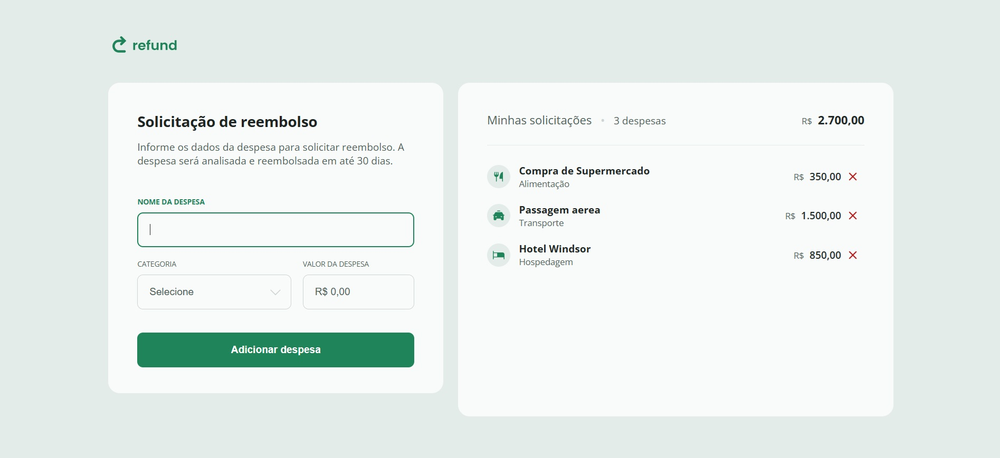

# Refund - Sistema de Solicitação de Reembolso

Este projeto foi desenvolvido para ajudar os alunos da Rocketseat estudarem JavaScript, manipulando o DOM e trabalhando com eventos em formulários. O sistema permite adicionar despesas e exibi-las em uma lista interativa.

Funcionalidades

Formulário para adicionar despesas com nome, categoria e valor

Formatação automática do valor no padrão BRL (Real)

Exibição das despesas adicionadas em uma lista

Cálculo total das despesas

Tecnologias Utilizadas

HTML5

CSS3

JavaScript (DOM e eventos)

Estrutura do Projeto

refund-project/
│── img/ # Pasta com os ícones das categorias
│── styles.css # Arquivo de estilos
│── scripts.js # Lógica do sistema
│── index.html # Estrutura principal do projeto
│── README.md # Documentação do projeto

Como Utilizar

Clone ou baixe este repositório.

Abra o arquivo index.html em um navegador.

Preencha o formulário com os detalhes da despesa.

Clique no botão "Adicionar despesa" para visualizar o item na lista.

Objetivo Educacional

Este projeto foi criado para os alunos praticarem conceitos fundamentais de JavaScript, como:

Manipulação do DOM

Manipulação de formulários

Manipulação de eventos

Formatação de valores monetários

Melhorias Futuras

Implementar a remoção de despesas

Salvar despesas no localStorage

Criar um sistema de autenticação simples

Sinta-se à vontade para modificar o projeto e aprimorar suas habilidades! 🚀
